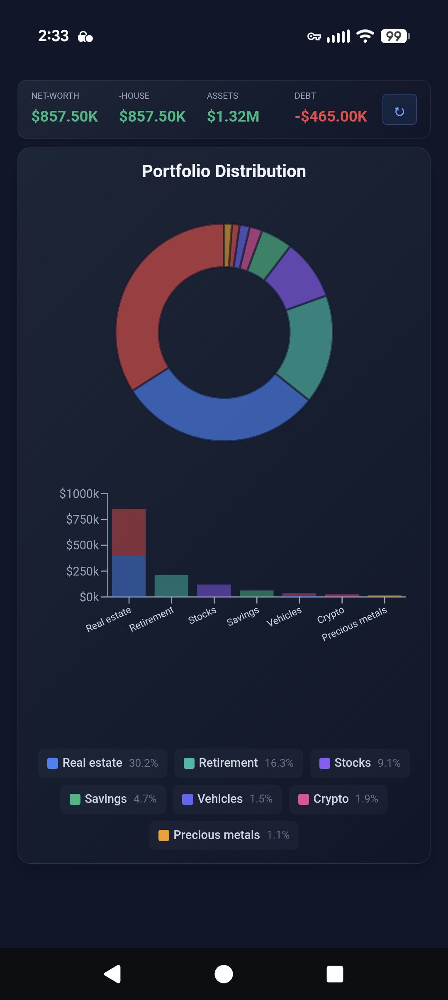
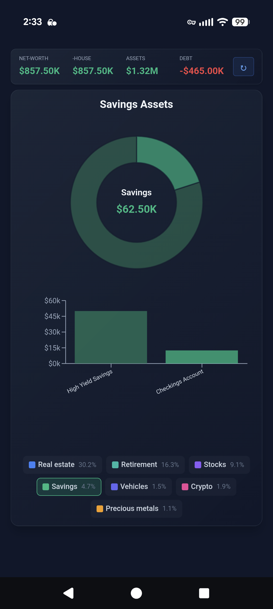
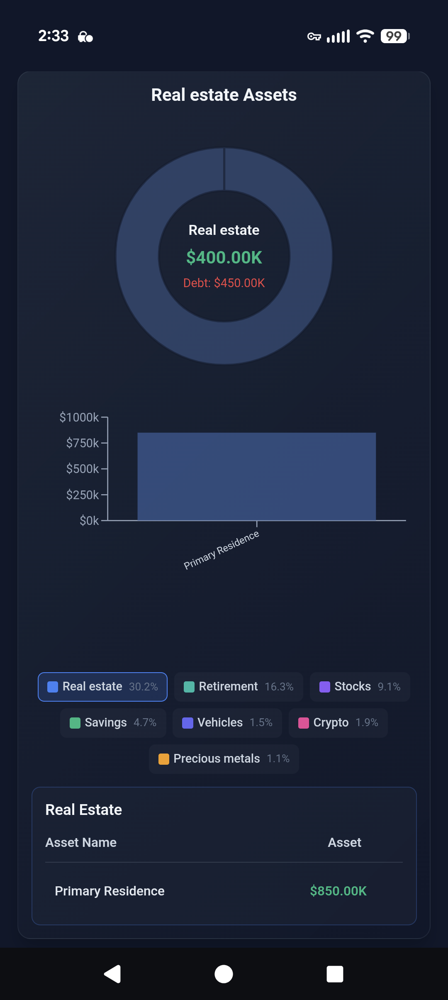
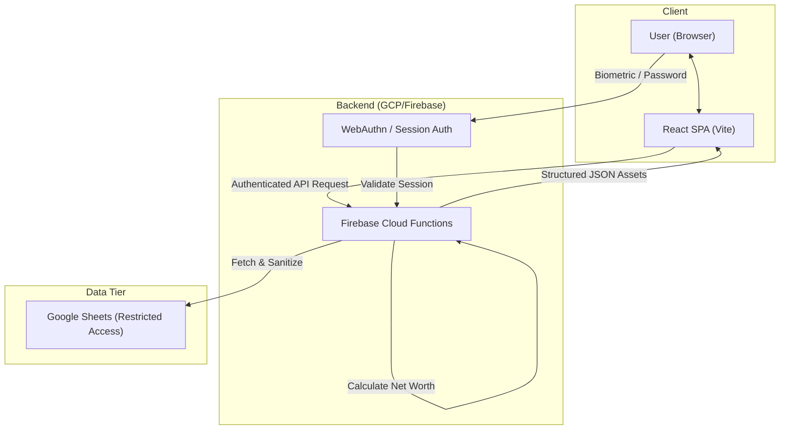

# Net Worth Visualization Dashboard

[](https://www.typescriptlang.org/)
[](https://react.dev/)
[](https://vitejs.dev/)
[](https://firebase.google.com/)
[](https://www.terraform.io/)
[](https://github.com/georgeckeller/net-worth-viz/actions/workflows/ci.yml)
[](LICENSE)

A privacy-first financial dashboard that visualizes personal net worth from a private Google Sheet. Built with a **server-side security architecture** — raw financial data and API keys never touch the client.

> **Why this exists:** Commercial net worth trackers (Mint, Personal Capital) require handing over bank credentials to third parties. This project gives you the same insights with zero data exposure — your spreadsheet, your cloud, your dashboard.

---

## Screenshots

<p align="center">
  
  
  
</p>

<p align="center">
  <em>Left to right: Portfolio distribution · Category drill-down · Asset-level detail with equity/debt split</em>
</p>

---

## Architecture

```
┌─────────────────────────────────────────────────────────────┐
│  Client (React SPA)                                         │
│  Vite + TypeScript + Recharts                               │
│  WebAuthn biometric auth / password gate                    │
└──────────────┬──────────────────────────────────────────────┘
               │ Authenticated POST (session token + CSRF)
               ▼
┌─────────────────────────────────────────────────────────────┐
│  Firebase Cloud Functions (Node.js 22)                      │
│  ┌─────────────┐  ┌──────────────┐  ┌───────────────────┐  │
│  │ Rate Limiter │  │ Session Mgmt │  │ Input Validation  │  │
│  └─────────────┘  └──────────────┘  └───────────────────┘  │
│  ┌─────────────────────────────────────────────────────┐    │
│  │ Data Transform: sanitize → compute → structured JSON│    │
│  └─────────────────────────────────────────────────────┘    │
└──────────┬──────────────────────────────┬───────────────────┘
           ▼                              ▼
┌────────────────────┐         ┌────────────────────┐
│  Google Sheets API │         │  Cloud Firestore   │
│  (service account) │         │  (sessions, rate   │
│                    │         │   limits — no raw  │
│                    │         │   financial data)  │
└────────────────────┘         └────────────────────┘
```

<details>
<summary>Mermaid source</summary>


</details>

---

## Key Features

| Feature | Implementation |
|---|---|
| **Interactive drill-down charts** | Recharts pie + stacked bar with two-level drill-down (category → individual asset), keyboard navigable |
| **WebAuthn biometric login** | Platform authenticator (TouchID/FaceID) with ECDSA signature verification, auto-prompt on launch, and persistent session tokens |
| **Server-side data pipeline** | Cloud Functions fetch, sanitize, and transform Google Sheets rows — client receives only structured JSON |
| **Defense in depth** | Timing-safe password comparison, CSRF tokens, rate limiting (5 req/15 min), session TTL (30 day), CSP headers, HSTS |
| **Infrastructure as Code** | Full Terraform config provisions GCP project, enables APIs, and configures Firebase — zero manual console work |
| **Structured observability** | GCP Cloud Logging with severity levels, request timing metrics, Cloud Error Reporting integration |
| **Accessibility** | ARIA labels, keyboard navigation, screen reader support, semantic HTML landmarks |
| **Real-time sync** | Configurable polling interval with client-side cache (5 min) to minimize API calls |
| **Zero persistent storage** | Financial data lives only in `sessionStorage` — nothing survives a tab close |

---

## Tech Stack

| Layer | Technology |
|---|---|
| **Frontend** | React 18, TypeScript 5.9, Vite 6, Recharts |
| **Backend** | Firebase Cloud Functions (Node.js 22), Google Sheets API |
| **Auth** | WebAuthn, SHA-256 password hashing, Firestore session tokens |
| **Infra** | Google Cloud Platform, Firebase Hosting, Terraform |
| **Testing** | Vitest (frontend, 54 tests), Jest (backend, 43 tests), smoke tests |
| **Observability** | GCP Cloud Logging (structured), Cloud Error Reporting, client-side error service |
| **Code Quality** | ESLint 9 (flat config), Prettier, strict TypeScript (zero `any` in production code) |

---

## Project Structure

```
net-worth-viz/
├── src/
│   ├── components/
│   │   ├── charts/
│   │   │   ├── PairedCategoryChart.tsx   # Orchestrator: pie + bar with drill-down
│   │   │   ├── ActiveShapeRenderer.tsx   # Custom donut center text
│   │   │   ├── ChartLegend.tsx           # Interactive category legend
│   │   │   └── CategoryDetailTable.tsx   # Asset-level detail grid
│   │   ├── Dashboard.tsx        # Main layout with semantic landmarks
│   │   ├── PasswordGate.tsx     # Auth gate with biometric fallback
│   │   └── NetWorthHero.tsx     # Key metrics display
│   ├── hooks/
│   │   ├── useAuth.ts           # Auth state, login/logout, biometrics
│   │   ├── useChartInteraction.ts  # useReducer state machine for chart UI
│   │   ├── useChartData.ts      # Memoized chart data preparation
│   │   ├── useGoogleSheets.ts   # API client with caching
│   │   └── useNetWorthData.ts   # Category grouping & net worth calc
│   ├── services/
│   │   ├── error.service.ts     # Structured error reporting (dev/prod)
│   │   ├── biometric.service.ts # WebAuthn with ECDSA verification
│   │   └── ...                  # API clients, session management
│   ├── types/                   # Shared TypeScript interfaces
│   └── utils/                   # Formatters, validators, color mapping
├── functions/
│   └── src/
│       ├── handlers/            # HTTP endpoints (getAssets, verifyPassword)
│       ├── middleware/           # Input validation & sanitization
│       └── utils/               # CORS, CSRF, rate limiting, session mgmt
├── terraform/                   # GCP infrastructure provisioning
├── scripts/                     # CI/CD and smoke test scripts
└── docs/
    ├── sample-data.csv          # Example Google Sheet format
    └── SETUP.md                 # Step-by-step deployment guide
```

---

## Security Model

This project treats security as a first-class architectural concern, not an afterthought.

- **Threat: credential exposure** → Service account keys live in GCP Secret Manager; the client never sees them
- **Threat: brute force** → IP-based rate limiting (5 attempts / 15 min) with Firestore-backed counters; load-balancer IP only (no spoofable headers)
- **Threat: timing attacks** → `crypto.timingSafeEqual()` for password hash comparison
- **Threat: session hijacking** → Cryptographically random 32-byte tokens, 30-day TTL, server-side validation
- **Threat: biometric bypass** → WebAuthn ECDSA signature verification against stored public key
- **Threat: XSS / injection** → Strict CSP via Firebase Hosting, input sanitization middleware, `X-Content-Type-Options: nosniff`
- **Threat: CSRF** → `X-Requested-With` header validation on all mutating endpoints
- **Threat: replay attacks** → Request timestamp validation (5-minute window)
- **Threat: data leakage** → Firestore rules deny all client access; only Admin SDK operates server-side

Full details in [SECURITY.md](SECURITY.md).

---

## Getting Started

### Prerequisites

- Node.js 22+, npm
- [Google Cloud CLI](https://cloud.google.com/sdk/docs/install) and [Terraform](https://developer.hashicorp.com/terraform/downloads)
- [Firebase CLI](https://firebase.google.com/docs/cli) (`npm i -g firebase-tools`)

### Quick Start

```bash
# Clone and install
git clone https://github.com/georgeckeller/net-worth-viz.git
cd net-worth-viz
npm install && cd functions && npm install && cd ..

# Provision infrastructure (one-time)
cd terraform && cp terraform.tfvars.example terraform.tfvars
# Edit terraform.tfvars with your GCP project ID
terraform init && terraform apply
cd ..

# Configure environment
cp .env.example .env.local
# Edit .env.local with your Sheet ID and API URLs

# Run locally
npm run dev

# Deploy
npm run ship   # lint → test → typecheck → build → deploy
```

For the full walkthrough, see the [Setup Guide](docs/SETUP.md).

---

## Available Scripts

| Command | Description |
|---|---|
| `npm run dev` | Start Vite dev server on `:8080` |
| `npm run build` | Production build with Terser minification |
| `npm test` | Run Vitest unit tests |
| `npm run test:all` | Frontend + backend test suites |
| `npm run test:coverage` | Generate coverage report |
| `npm run ship` | Full CI pipeline: lint + typecheck + test + build + deploy |
| `npm run typecheck` | TypeScript type checking (`tsc --noEmit`) |

---

## License

[MIT](LICENSE) — George Keller
